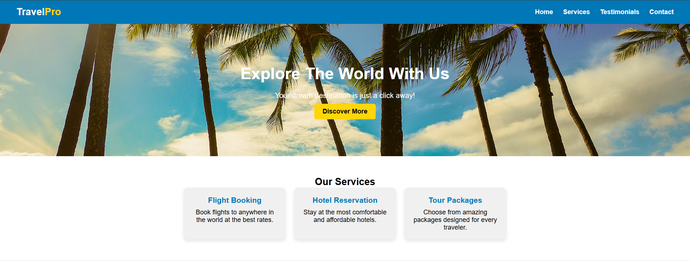
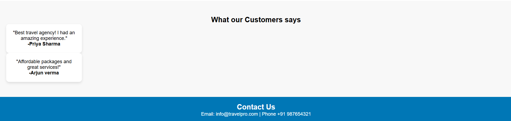

# Travel Agency

A simple Travel Agency landing page built to reinforce core concepts such as semantic HTML, CSS styling, layouts, and Flexbox.

## 🛠️ Tech Stack
HTML, CSS

## 🔍 Preview

### Home & Mobile View
<p align="center">
  
  
</p>

### Services Section


## 🚀 Getting Started

```bash
git clone https://github.com/shrivastavrohan12-droid/TRAVEL-AGENCY-HTML-CSS-.git
cd TRAVEL-AGENCY-HTML-CSS-
# No installation required, simply open index.html in your browser
```

## 📁 Project Structure
- `index.html`: Main HTML file containing the structure of the landing page.
- `style.css`: Stylesheet with layout and design for the page.
- `screenshots/`: Visual previews of the project.

## 📌 Notes
Built to practice responsive design, focusing on improving coding practices while creating a clean and user-friendly interface.